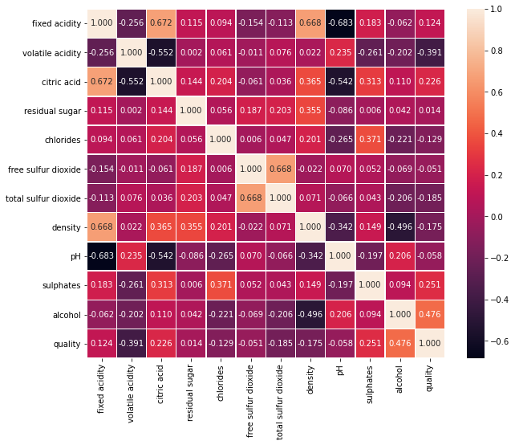
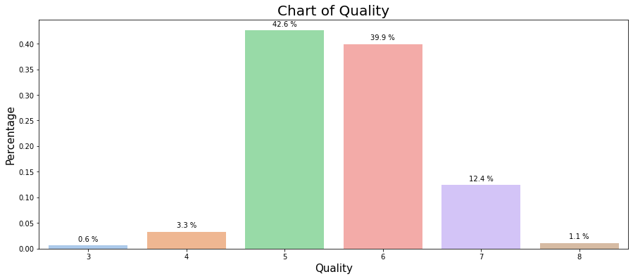
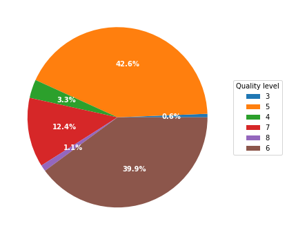
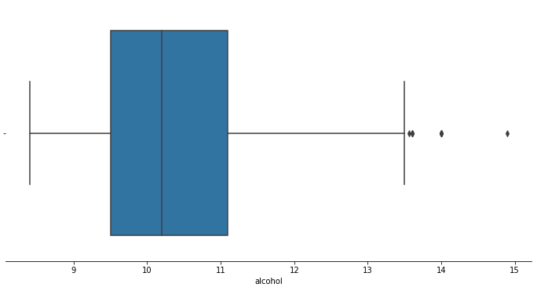
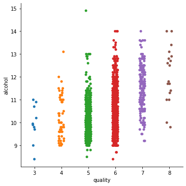

```python
import sys
!{sys.executable} -m pip install numpy pandas matplotlib sklearn seaborn
```

### 1 - Step

**1.** Looking for missing values.


```python
import numpy as np
import pandas as pd
import matplotlib.pyplot as plt


#%matplotlib inline
%matplotlib notebook 

df = pd.read_csv('./winequality-red.csv')

df_missig_values = df[df.isna() == True].value_counts()

print("Checking if contains missing values: {}".format(len(df_missig_values)))
print("Size: {} rows and {} features".format(df.shape[0], df.shape[1]))
```

    Checking if contains missing values: 0
    Size: 1599 rows and 12 features
    


```python
df.describe()

```


<div>
<style scoped>
    .dataframe tbody tr th:only-of-type {
        vertical-align: middle;
    }

    .dataframe tbody tr th {
        vertical-align: top;
    }

    .dataframe thead th {
        text-align: right;
    }
</style>
<table border="1" class="dataframe">
  <thead>
    <tr style="text-align: right;">
      <th></th>
      <th>fixed acidity</th>
      <th>volatile acidity</th>
      <th>citric acid</th>
      <th>residual sugar</th>
      <th>chlorides</th>
      <th>free sulfur dioxide</th>
      <th>total sulfur dioxide</th>
      <th>density</th>
      <th>pH</th>
      <th>sulphates</th>
      <th>alcohol</th>
      <th>quality</th>
    </tr>
  </thead>
  <tbody>
    <tr>
      <th>count</th>
      <td>1599.000000</td>
      <td>1599.000000</td>
      <td>1599.000000</td>
      <td>1599.000000</td>
      <td>1599.000000</td>
      <td>1599.000000</td>
      <td>1599.000000</td>
      <td>1599.000000</td>
      <td>1599.000000</td>
      <td>1599.000000</td>
      <td>1599.000000</td>
      <td>1599.000000</td>
    </tr>
    <tr>
      <th>mean</th>
      <td>8.319637</td>
      <td>0.527821</td>
      <td>0.270976</td>
      <td>2.538806</td>
      <td>0.087467</td>
      <td>15.874922</td>
      <td>46.467792</td>
      <td>0.996747</td>
      <td>3.311113</td>
      <td>0.658149</td>
      <td>10.422983</td>
      <td>5.636023</td>
    </tr>
    <tr>
      <th>std</th>
      <td>1.741096</td>
      <td>0.179060</td>
      <td>0.194801</td>
      <td>1.409928</td>
      <td>0.047065</td>
      <td>10.460157</td>
      <td>32.895324</td>
      <td>0.001887</td>
      <td>0.154386</td>
      <td>0.169507</td>
      <td>1.065668</td>
      <td>0.807569</td>
    </tr>
    <tr>
      <th>min</th>
      <td>4.600000</td>
      <td>0.120000</td>
      <td>0.000000</td>
      <td>0.900000</td>
      <td>0.012000</td>
      <td>1.000000</td>
      <td>6.000000</td>
      <td>0.990070</td>
      <td>2.740000</td>
      <td>0.330000</td>
      <td>8.400000</td>
      <td>3.000000</td>
    </tr>
    <tr>
      <th>25%</th>
      <td>7.100000</td>
      <td>0.390000</td>
      <td>0.090000</td>
      <td>1.900000</td>
      <td>0.070000</td>
      <td>7.000000</td>
      <td>22.000000</td>
      <td>0.995600</td>
      <td>3.210000</td>
      <td>0.550000</td>
      <td>9.500000</td>
      <td>5.000000</td>
    </tr>
    <tr>
      <th>50%</th>
      <td>7.900000</td>
      <td>0.520000</td>
      <td>0.260000</td>
      <td>2.200000</td>
      <td>0.079000</td>
      <td>14.000000</td>
      <td>38.000000</td>
      <td>0.996750</td>
      <td>3.310000</td>
      <td>0.620000</td>
      <td>10.200000</td>
      <td>6.000000</td>
    </tr>
    <tr>
      <th>75%</th>
      <td>9.200000</td>
      <td>0.640000</td>
      <td>0.420000</td>
      <td>2.600000</td>
      <td>0.090000</td>
      <td>21.000000</td>
      <td>62.000000</td>
      <td>0.997835</td>
      <td>3.400000</td>
      <td>0.730000</td>
      <td>11.100000</td>
      <td>6.000000</td>
    </tr>
    <tr>
      <th>max</th>
      <td>15.900000</td>
      <td>1.580000</td>
      <td>1.000000</td>
      <td>15.500000</td>
      <td>0.611000</td>
      <td>72.000000</td>
      <td>289.000000</td>
      <td>1.003690</td>
      <td>4.010000</td>
      <td>2.000000</td>
      <td>14.900000</td>
      <td>8.000000</td>
    </tr>
  </tbody>
</table>
</div>


#### Dataframe info

- Dataframe have 1599 records
- Data columns: total 12 columns
- There is no missing values
- There is no categorical feature

### 2 - Step

**2.** Correlation between the features


```python
import seaborn as sns
%matplotlib inline

plt.subplots(figsize=(10, 8))

sns.heatmap(df.corr(), annot=True, fmt=".3f", linewidths=.5);
```


    

    


```python
# Normalize the dataframe to return proportions rather than frequencies
def normalize_data(dataframe, column, ascending):
    '''
    Parameters
    ----------
        dataframe: DataFrame
            Data structure with labeled axes
        column: str
            Column label to use for normalization
        ascending: bool
            Sort ascending (True) or descending (False)
            
    Returns
    -------
        dataframe: DataFrame
            Dataframe normalized with proportions according to the column
    '''
    return dataframe[column].value_counts(normalize=True).sort_values(ascending=ascending).to_frame()
```


```python
plt.figure(figsize=(15,6))
    
quality_count = normalize_data(df, 'quality', False)
quality_count = quality_count.rename(columns={'quality':'Percentage'})

ax = sns.barplot(x=quality_count.index, y='Percentage', data=quality_count, palette="pastel")

# Annotate the point xy with number formatted like percentage
# For more details look on https://matplotlib.org/3.3.3/api/_as_gen/matplotlib.axes.Axes.annotate.html#matplotlib.axes.Axes.annotate 
for p in ax.patches:
    ax.annotate('{:.1f} %'.format((p.get_height() * 100)),
               (p.get_x() + p.get_width() / 2., p.get_height()),
               ha='center', va='center',
               xytext = (0,9),
               textcoords='offset points')
    
plt.xlabel("Quality", fontsize=15)
plt.ylabel("Percentage", fontsize=15)
plt.title("Chart of Quality", fontsize=20)
plt.show()

```


    

    


### 3 - Step

**3.** Transform into percentage values


```python
def convert_value_into_percentage(fraction_number):
    '''
    Parameters
    ----------
        fraction_number: float
            Number in decimal form
    
    Returns
    -------
        float
            the percentage calculated
    '''
    return fraction_number * 100
```


```python
quality_count = normalize_data(df, 'quality', True)

# I sorted to look better on the pie chart
quality_count = quality_count.rename(columns={'quality':'Percentage'}).sort_values(by='Percentage').reindex([3, 5, 4, 7, 8, 6])

# Apply the function to transform
quality_count['Percentage'] = quality_count['Percentage'].apply(convert_value_into_percentage)


# Building a plot
fig1, ax1 = plt.subplots(figsize=(6, 6))

wedges, texts, autotexts = ax1.pie(quality_count['Percentage'], autopct='%1.1f%%', startangle=0, textprops=dict(color="w"))

ax1.legend(wedges, quality_count.index,
          title="Quality level",
          loc="center left",
          bbox_to_anchor=(1, 0, 0, 1))

plt.setp(autotexts, size=10, weight="bold")

plt.show()
```


    

    


### 4 - Step

**4.** Looking on alcohol features distribution using box plot


```python
f, ax = plt.subplots(1, 1, figsize=(12, 6))
sns.despine(left=True)

sns.boxplot(x=df['alcohol'])
#sns.boxplot(x=df['citric acid'], ax=ax[1])
#sns.boxplot(x=df['sulphates'], ax=ax[2])

plt.show()
```


    

    


### 5 - Step

**5.** Looking the alcohol features distribution bases on quality


```python
sns.catplot(x="quality", y="alcohol", data=df)
plt.show()
```


    

    

